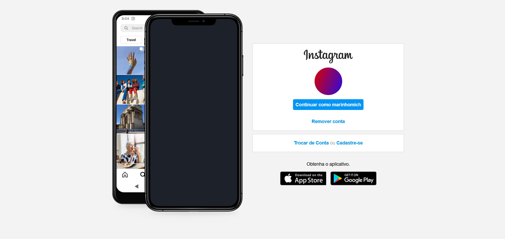

# Digital Innovation One - Recriando a página inicial do Instagram

Essa é a solução para **Recriando a página inicial do Instagram** como parte do Santander Bootcamp Fullstack Developer.

## Visão geral

### O desafio

O projeto faz parte do Bootcamp Santander Fullstack Developer da Digital Innovation One.
Nesse projeto foi abordado o conceito de CSS Flexbox e responsividade.

### Captura de Tela

### Links

- Link Demo : [DIO - Instagram](https://dio-instagram-marinhomich.vercel.app/)

## Tecnologias utilizada

- HTML
- CSS

## Autor

- Website - [Michel Marinho](https://marinhomich.dev)
- Twitter - [@marinhomich](https://www.twitter.com/marinhomich)